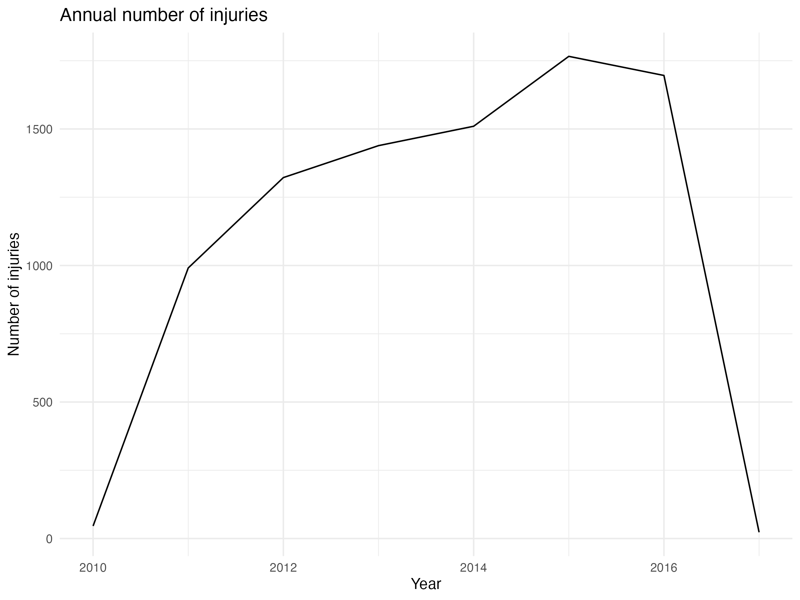
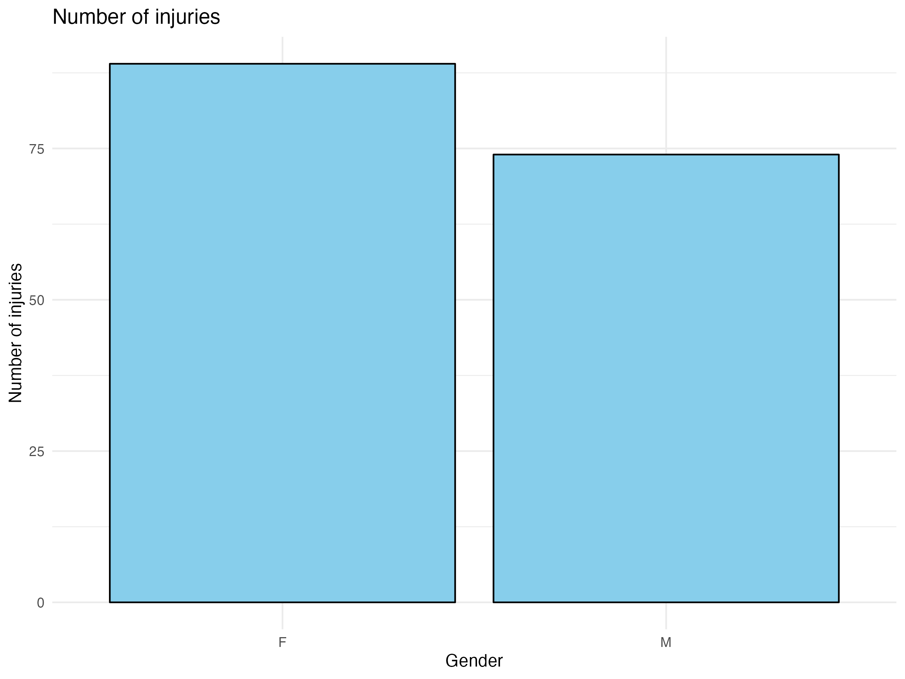
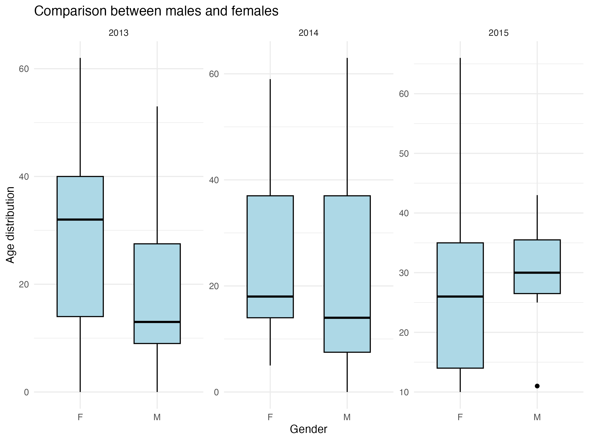

```{r global, include=FALSE}
# load data in 'global' chunk so it can be shared by all users of the dashboard
safer_parks <- readr::read_csv("data/safer_parks.csv")
tx_injuries <- readr::read_csv("data/tx_injuries.csv")
```

# About

## Column

### Purpose of this dashboard 

This dashboard investigates the pattern of individual and park's injuries in United states. The original data comes from tidyverse: [saferparks](https://github.com/rfordatascience/tidytuesday/blob/master/data/2019/2019-09-10/saferparks.csv) and [tx_injuries](https://github.com/rfordatascience/tidytuesday/blob/master/data/2019/2019-09-10/tx_injuries.csv). Additional data can be found at [SaferParks Database](https://ridesdatabase.org/saferparks/data/).


In this dashboard, we explore:

1. Safety Tips

2. Previous Outcomes

3. Distribution of Park Injuries

4. Distribution of Taxas Injuries

<iframe width="900" height="500" src="https://www.youtube.com/embed/eK6SXhpSMGU?si=k74xfa8otKQm8bLk" title="YouTube video player" frameborder="0" allow="accelerometer; autoplay; clipboard-write; encrypted-media; gyroscope; picture-in-picture; web-share" allowfullscreen></iframe>


# The Data
The original data were downloaded from tidyverse: [saferparks](https://github.com/rfordatascience/tidytuesday/blob/master/data/2019/2019-09-10/saferparks.csv) and [tx_injuries](https://github.com/rfordatascience/tidytuesday/blob/master/data/2019/2019-09-10/tx_injuries.csv). The tables of dataset are as follow:

### `tx_injuries.csv`

|variable          |class     |description |
|:-----------------|:---------|:-----------|
|injury_report_rec |double    | Unique Record ID |
|name_of_operation |character | Company name |
|city              |character | City |
|st                |character | State (all TX) |
|injury_date       |character | Injury date - note there are some different formats |
|ride_name         |character | Ride Name |
|serial_no         |character | Serial number of ride |
|gender            |character | Gender of the injured individual |
|age               |character | Age of the injured individual |
|body_part         |character | Body part injured |
|alleged_injury    |character | Alleged injury - type of injury |
|cause_of_injury   |character | Approximate cause of the injury (free text) |
|other             |character | Anecdotal information in addition to cause of injury |

### `safer_parks.csv`

|variable             |class     |description |
|:--------------------|:---------|:-----------|
|acc_id               |double    | Unique ID |
|acc_date             |character | Accident Date |
|acc_state            |character | Accident State |
|acc_city             |character | Accident City |
|fix_port             |character |.           |
|source               |character | Source of injury report |
|bus_type             |character | Business type |
|industry_sector      |character | Industry sector |
|device_category      |character | Device category |
|device_type          |character | Device type |
|tradename_or_generic |character | Common name of the device |
|manufacturer         |character | Manufacturer of device |
|num_injured          |double    | Num injured |
|age_youngest         |double    | Youngest individual injured |
|gender               |character | Gender of individual injured |
|acc_desc             |character | Description of accident |
|injury_desc          |character | Injury description |
|report               |character | Report URL |
|category             |character | Category of accident |
|mechanical           |double    | Mechanical failure (binary NA/1) |
|op_error             |double    | Operator error (binary NA/1)|
|employee             |double    | Employee error (binary NA/1)|
|notes                |character | Additional notes| 

# Safety Tips

## Row {data-height=250}

### Safety tips for riders of all ages

Most amusement ride injuries can be prevented if you know what to watch out for.

### Top 10 Tips for Parents

Treat amusement ride safety seriously, just like traffic safety, water safety, and bike safety.

### Attention Matters and So Do the Rules

Beware of patron daze, rule fudging, wiggle worms and horseplay.

## Row {data-height=250}

### Carnival Safety Video

Kids and adults can learn how to have a safe, fun time on the midway.

### Minimum Height Restrictions

For some kids on some rides, minimum height limits set by manufacturers may be too low for safety.

### Find the Ride that Fits

For safety's sake, make sure the ride fits the rider, especially for kids.


# Previous Outcomes

## Column {.tabset}

### Anual Number of Injuries
::: {#fig-obs-loc}
{width="65%"}
:::


### Number of Injuries in Genders
::: {#fig-obs-loc}
{width="65%"}
:::

### Comparisons Between Females and Males
::: {#fig-obs-loc}
{width="65%"}
:::


# Distribution of Park Injuries

## Column {.sidebar}

Park accident data in each states. The number represents injuries frequency each time and the columns of histogram represents the prevalence. 

```{r}
selectInput("selected_state", label = "Select State:",
            choices = unique(safer_parks$acc_state), selected = "OH")
      
sliderInput("bw_adjust", label = "Bandwidth adjustment:",
            min = 0.2, max = 2, value = 1, step = 0.2)
```

## Column

### Distribution of Park Injuries

```{r}
renderPlot({
   selected_data <- reactive({
    subset(safer_parks, acc_state == input$selected_state)})
   
    agg_data <- aggregate(num_injured ~ acc_date, data = selected_data(), sum)

    hist(agg_data$num_injured, probability = TRUE, col = "lightblue",
         xlab = "Number of Injuries", main = "Distribution of Park Injuries")

    dens <- density(agg_data$num_injured, adjust = input$bw_adjust)
    lines(dens, col = "blue")
})
```

# Distribution of Taxas Injuries

## Column {.sidebar}

```{r}
library(dplyr)
library(tidyr)
library(purrr)
library(lubridate)
tx_injuries <- tx_injuries %>% drop_na(age)
tx_injuries <- tx_injuries %>% drop_na(gender)
tx_injuries <- tx_injuries %>%
  filter(!(age %in% c("n/a", "na", "n.a")))
tx_injuries <- tx_injuries %>%
  mutate(gender = toupper(gender)) %>%
  filter(!(gender %in% c("n/a", "na", "n.a", "N/A", "NA")))
year1 <- tx_injuries$injury_date |>
  map(.f = ~as.Date(.x, format = "%m/%d/%Y")) |>
  map_dbl(.f = ~year(.x))
tx_injuries <- mutate(tx_injuries, year1)
tx_injuries <- tx_injuries %>% drop_na(year1)
selectInput("selected_gender", label = "Select Gender:",
            choices = unique(tx_injuries$gender), selected = "M")

selectInput("selected_year", label = "Select Year:",
            choices = unique(tx_injuries$year1), selected = 2013)

```

## Column

### Distribution of Taxas Injuries

```{r}
renderPlot({
   selected_data <- reactive({
     tx_injuries %>% select (gender, year1, age) %>% 
       filter(gender == input$selected_gender & year1 == input$selected_year)
    })

    hist(as.numeric(selected_data()$age), probability = TRUE, col = "lightblue",
         xlab = "Age of Injury", main = "Distribution of Taxas Injuries")

})
```


# Analysis

## Column

### Example Analysis

**Data analysis**

::: {#fig-obs-loc}
{width="65%"}
:::
Figure 1

The figure shows that it has the highest number of injuries at the year of 2015.

::: {#fig-obs-loc}
{width="65%"}
:::
Figure 2

It seems that females get injured more often than males.

::: {#fig-obs-loc}
{width="65%"}
:::
Figure 3

The age distributions between males and females are different at each year. In 2013 and 2014, more younger males get injured than females. And situation got opposite in 2015.


**Conclusion**

The numbers of injuries varies from years and gender.